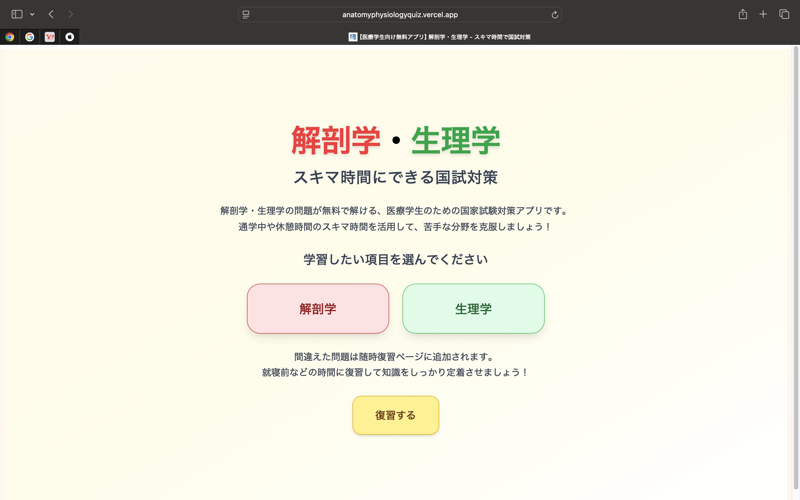
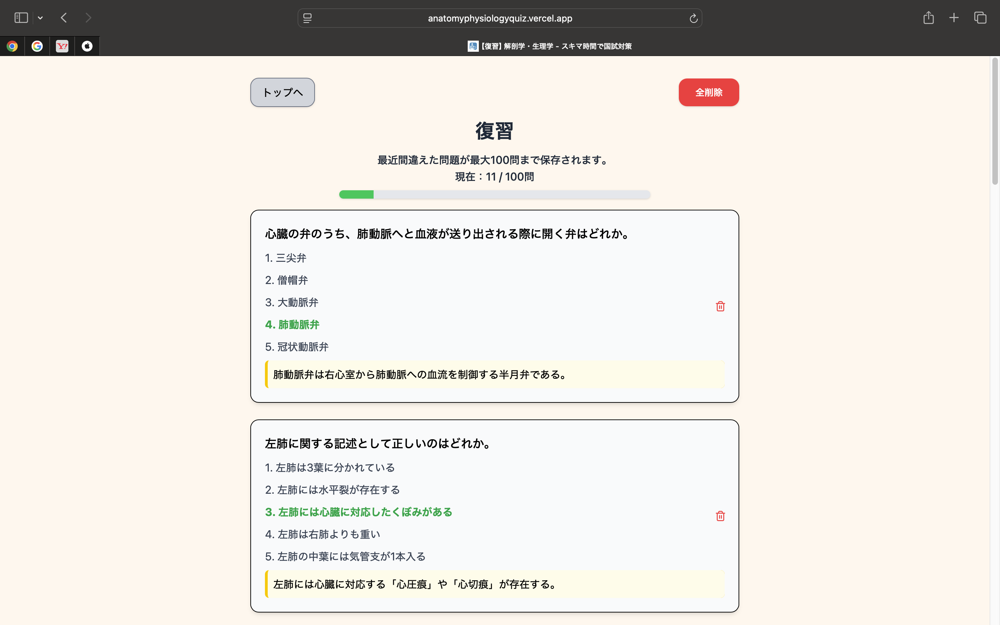
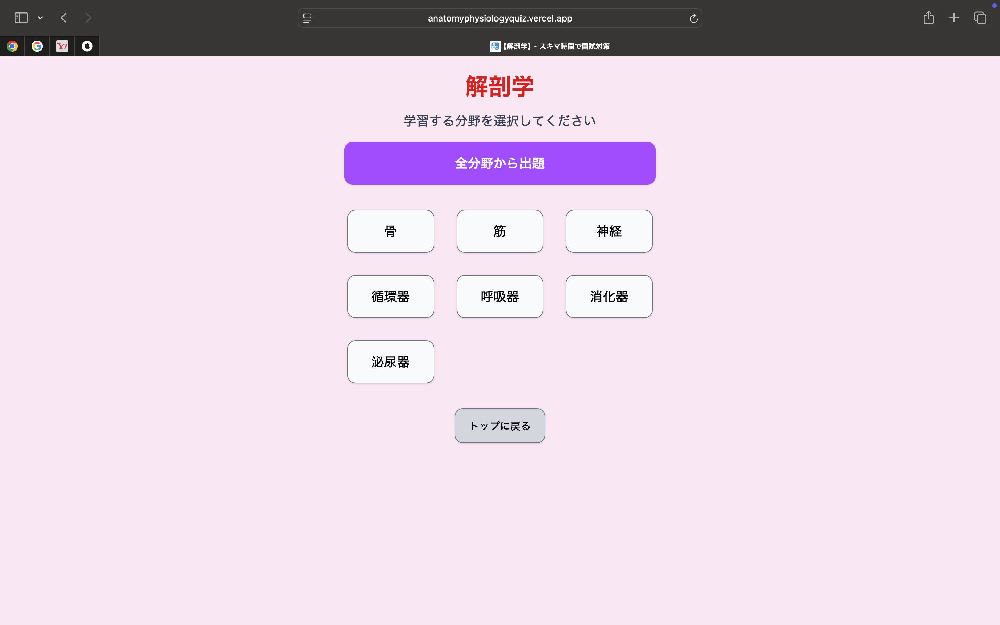
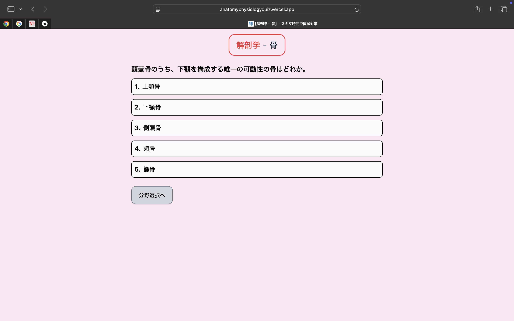
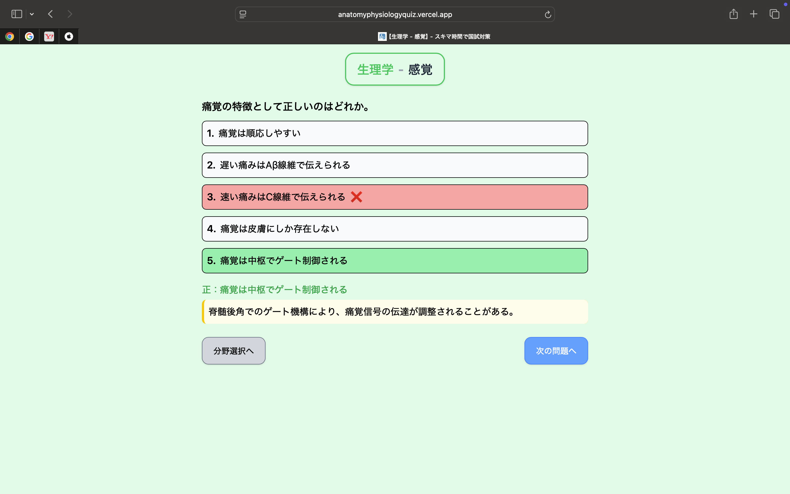

# 解剖学・生理学 | スキマ時間にできる国試対策


医療系国家資格を目指す学生向けの、**解剖学・生理学をスキマ時間で効率よく学習できる Web アプリ**です。国家試験形式の問題にスマホで手軽にチャレンジでき、復習もしやすいように設計しました。

---

## アプリ URL

▶️ [https://anatomyphysiologyquiz.vercel.app/](https://anatomyphysiologyquiz.vercel.app/)

PC / スマホ両対応です。アカウント登録なしで今すぐ利用できます。

---

## 主な機能

- 科目選択（解剖学 or 生理学）
- 各科目内での分野選択（例: 骨、筋、神経 など）
- 選んだ分野 or 全体からランダムに問題を出題
- 回答結果と解説をその場で表示
- 間違えた問題は自動でローカルストレージに保存し、復習ページに表示
- スマホ対応のレスポンシブデザイン
- SNS シェア時の OGP 画像もページごとに設定済み

---

## アプリ内の主な画面

| ホーム画面                             | 復習ページ                                 |
| -------------------------------------- | ------------------------------------------ |
|  |  |

| 解剖学：分野選択                                         | 解剖学：問題出題                                       |
| -------------------------------------------------------- | ------------------------------------------------------ |
|  |  |

| 生理学：分野選択                                               | 生理学：問題出題                                             |
| -------------------------------------------------------------- | ------------------------------------------------------------ |
|  |  |

---

## 使用技術スタック

| 分類           | 技術構成                                          | 補足説明                                                     |
| -------------- | ------------------------------------------------- | ------------------------------------------------------------ |
| フロントエンド | Next.js 15 (App Router)、TypeScript、Tailwind CSS | 最新の App Router 構成で、型安全性とモバイル対応を考慮       |
| バックエンド   | Next.js Server Actions、REST API                  | 状況に応じて使い分け、API レスポンスの最適化を実施           |
| データベース   | Supabase（PostgreSQL）、Prisma ORM                | クラウド DB として Supabase を利用し、型安全な Prisma を併用 |
| デプロイ       | Vercel                                            | GitHub 連携により、プッシュ時に自動でデプロイ                |
| その他         | OGP 設定、ルーティング設計、git、gitHub           | SEO 対応のための OGP 設定も実装                              |

> Supabase の手軽さと Prisma の型安全性を両立する設計に挑戦しました。Next.js App Router で柔軟なルーティングとパフォーマンス最適化も実装しています。

---

## ディレクトリ構成（一部抜粋）

```
/
├── prisma/ # Prisma の設定ファイル
│ └── migrations/
│ └── schema.prisma
├── public/ # 静的ファイル（OGP画像、スクリーンショットなど）
│ └── screenshots/
│ └── favicon.ico など
├── src/ # ソースコードのルート
│ ├── app/ # App Router のルーティング
│ │ ├── api/questions
│ │ │ └── route.ts # apiエンドポイント（ルートハンドラ）
│ │ ├── questions/[category]/[field]
│ │ │ └── page.tsx # 問題出題ページ
│ │ ├── review/
│ │ │ └── page.tsx # 復習ページ
│ │ │ └── ReviewClient.tsx # クライアントコンポーネント
│ │ ├── subjects/[category]/
│ │ │ └── page.tsx # 分野選択ページ
│ │ ├── layout.tsx # アプリ全体のレイアウト
│ │ ├── page.tsx # ホーム画面
│ │ └── ... # その他エラーページやローディングページなど
│ ├── assets/
│ │ └── global.css
│ ├── components/ # 再利用可能なUIコンポーネント群
│ │ ├── QuestionDisplay.tsx
│ │ ├── button.tsx
│ │ ├── dialog.tsx
│ │ ├── ConfirmDialog.tsx
│ │ └── LoadingUi.tsx
│ ├── lib/ # 外部サービスや汎用処理ロジック
│ │ ├── getRandomQuestion.ts # クイズ出題関連の処理
│ │ ├── prisma.ts # Prisma クライアント初期化
│ │ ├── subjects.ts # 科目や分野の一覧・ラベル定義
│ │ └── utils.ts # ユーティリティ関数
│ ├── types/
│ │ └── questions.ts # 問題オブジェクトの型情報
├── .env # 環境変数（Supabaseなどの接続情報）
├── .gitignore # Git追跡除外ファイル一覧
├── next.config.js # Next.js の設定ファイル
├── package.json # 依存関係とスクリプト定義
├── tsconfig.json # TypeScript の設定
└── README.md
```

---

## 今後の追加・改善予定

- ログイン機能の実装（学習履歴・正答率・復習状況を個人に紐づけて保存）
- 解説の充実化（視覚的に理解できるような画像やイラスト、詳しい論文へのリンクなどの追加）
- タイマー機能（「20 分間で 20 問」など、時間制限ありの模擬試験形式）
- ユーザーからのフィードバック機能（各問題に「この問題は不適切です」などのボタンを設置し、報告を受けられる）
- 病理学などの医療系国家資格で共通科目の問題作成

---

## ローカル環境での実行方法

```bash
git clone https://github.com/gakky525/my-portfolio.git
cd my-portfolio
npm install
npm run dev
```
