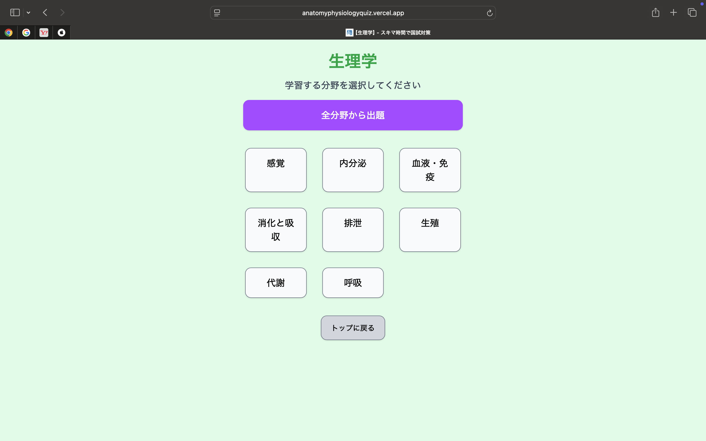
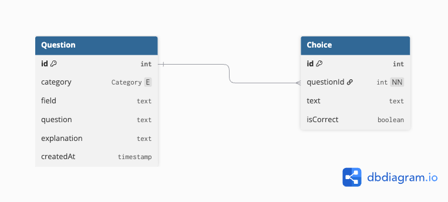

# 解剖学・生理学 | スキマ時間にできる国試対策

医療系国家資格を目指す学生向けの、**解剖学・生理学をスキマ時間で効率よく学習できる Web アプリ**です。国家試験形式の問題にスマホで手軽にチャレンジでき、復習もしやすいように設計しました。

---

## アプリ URL

[https://anatomyphysiologyquiz.vercel.app/](https://anatomyphysiologyquiz.vercel.app/)

PC / スマホ両対応です。アカウント登録不要で今すぐ利用できます。

---

### アプリ開発背景

「通学中や授業の合間などのスキマ時間に、少しでも勉強を進めたい。」
国家試験前の私は、いつもそう考えていました。
しかし、混雑した電車やバスの中で参考書を広げるのは手間がかかり、正直、気が進まないことも多くありました。
スマホで手軽に勉強できるアプリを探してみたこともありましたが、使い勝手が悪かったり、自分のニーズに合わなかったりして、結局は参考書に頼らざるを得ませんでした。

「もしあのとき、使いやすい学習アプリがあれば…」
そんな思いが、このアプリを開発しようと考えたきっかけです。

このアプリは、医療系国家試験の共通基盤となる「解剖学・生理学」に特化し、スキマ時間にスマホひとつで完結する学習体験を提供します。
学習したい分野を選ぶだけで問題が表示され、解答後すぐに解説を確認できるため、2〜3 分の短い空き時間でも、教科書なしで理解を深められるよう工夫しています。
また、間違えた問題は自動的にブラウザに保存されるため、後から復習することも可能です。

このアプリが、かつての私と同じようにスキマ時間を有効活用したいと願う医療学生の力になれば嬉しく思います。

---

## 主な機能

- 科目選択（解剖学 or 生理学）
- 各科目内での分野選択（例: 骨、筋、神経 など）
- 選んだ分野 or 全体からランダムに問題を出題
- 回答結果と解説をその場で表示
- 間違えた問題は自動でローカルストレージに保存し、復習ページに表示
- スマホ対応のレスポンシブデザイン

---

## アプリ内の主な画面

| ホーム画面                             | 復習ページ                                 |
| -------------------------------------- | ------------------------------------------ |
|  |  |

| 解剖学：分野選択                                         | 解剖学：問題出題                                       |
| -------------------------------------------------------- | ------------------------------------------------------ |
|  |  |

| 生理学：分野選択                                               | 生理学：問題出題                                             |
| -------------------------------------------------------------- | ------------------------------------------------------------ |
|  |  |

---

## 使用技術スタック


| 分類           | 技術構成                                          | 補足説明                                                     |
| -------------- | ------------------------------------------------- | ------------------------------------------------------------ |
| Frontend       | Next.js 15 (App Router)、TypeScript、Tailwind CSS | 最新の App Router 構成で、型安全性とモバイル対応を考慮       |
| Backend        | Next.js Server Actions、TypeScript                | 状況に応じて使い分け、パフォーマンスの最適化を実施           |
| Database       | Supabase（PostgreSQL）、Prisma                    | クラウド DB として Supabase を利用し、型安全な Prisma を併用 |
| Infrastructure | Vercel                                            | GitHub 連携により、プッシュ時に自動でデプロイ                |
| etc            | OGP 設定、git、gitHub                             | SEO 対応のための OGP 設定も実装                              |

> Supabase の手軽さと Prisma の型安全性を両立する設計に挑戦しました。Next.js App Router で柔軟なルーティングとパフォーマンス最適化も実装しています。

---

## ER 図



---

## ディレクトリ構成（一部抜粋）

```
/
├── prisma/ # Prisma の設定ファイル
│ └── migrations/
│ └── schema.prisma
├── public/ # 静的ファイル（OGP画像、スクリーンショットなど）
│ └── screenshots/
│ └── favicon.ico など
├── src/ # ソースコードのルート
│ ├── app/ # App Router のルーティング
│ │ ├── api/questions
│ │ │ └── route.ts # apiエンドポイント（ルートハンドラ）
│ │ ├── questions/[category]/[field]
│ │ │ └── page.tsx # 問題出題ページ
│ │ ├── review/
│ │ │ └── page.tsx # 復習ページ
│ │ │ └── ReviewClient.tsx # クライアントコンポーネント
│ │ ├── subjects/[category]/
│ │ │ └── page.tsx # 分野選択ページ
│ │ ├── layout.tsx # アプリ全体のレイアウト
│ │ ├── page.tsx # ホーム画面
│ │ ├── robots.ts # SEO最適化
│ │ ├── sitemap.ts #SEO最適化
│ │ └── ... # その他エラーページやローディングページなど
│ ├── assets/
│ │ └── global.css
│ ├── components/ # 再利用可能なUIコンポーネント群
│ │ ├── QuestionDisplay.tsx
│ │ ├── button.tsx
│ │ ├── dialog.tsx
│ │ ├── ConfirmDialog.tsx
│ │ └── LoadingUi.tsx
│ ├── lib/ # 外部サービスや汎用処理ロジック
│ │ ├── getRandomQuestion.ts # クイズ出題関連の処理
│ │ ├── prisma.ts # Prisma クライアント初期化
│ │ ├── subjects.ts # 科目や分野の一覧・ラベル定義
│ │ └── utils.ts # ユーティリティ関数
│ └── types/
│   └── questions.ts # 問題オブジェクトの型情報
├── .env # 環境変数（Supabaseなどの接続情報）
├── .gitignore # Git追跡除外ファイル一覧
├── next.config.js # Next.js の設定ファイル
├── package.json # 依存関係とスクリプト定義
├── tsconfig.json # TypeScript の設定
└── README.md
```

---

## 今後の追加・改善予定

- ログイン機能の実装（学習履歴・正答率・復習状況を個人に紐づけて保存）
- 解説の充実化（視覚的に理解できるような画像やイラスト、詳しい論文へのリンクなどの追加）
- タイマー機能（「20 分間で 20 問」など、時間制限ありの模擬試験形式）
- ユーザーからのフィードバック機能（各問題に「この問題は不適切です」などのボタンを設置し、報告を受けられる）
- 病理学などの医療系国家資格で共通科目の問題作成
